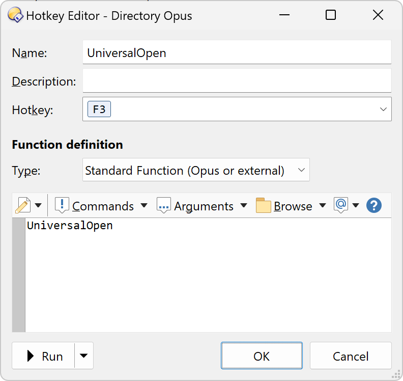

# DirectoryOpus-UniversalOpen-plugin
A smart "open file" script that enables the creation of a keyboard shortcut or command to open a file with a program based on its extension or MIME type. It also allows specifying a particular command for managed or native DLLs or executables.

## How to use (it is only one of the options)
* Download the script from the [Releases page](https://github.com/PolarGoose/DirectoryOpus-UniversalOpen-plugin/releases)
* Adjust the `Script configuration section` at the beginning of the script.
* Copy and paste the script file into the Directory Opus plugins folder `%AppData%\GPSoftware\Directory Opus\Script AddIns`
* Right click on the toolbar -> Customize -> Keys ->"New Lister Hotkey."
* Fill in `UniversalOpen` in the `Function` field. 

## How it works
* If nothing is selected or a folder is selected, the `folderOpeningProgram` is used.
* If an executable or DLL is selected, the script determines if it is a native or managed binary and uses `nativeExeOrDllHandlingProgram` or `managedExeOrDllHandlingProgram` accordingly.
* If a file is selected, the program uses its extension and checks the p`redefinedFileExtensions` table to find the appropriate program. If the program is not found, it retrieves the MIME type of the file and checks the `predefinedMimeTypes` table.
